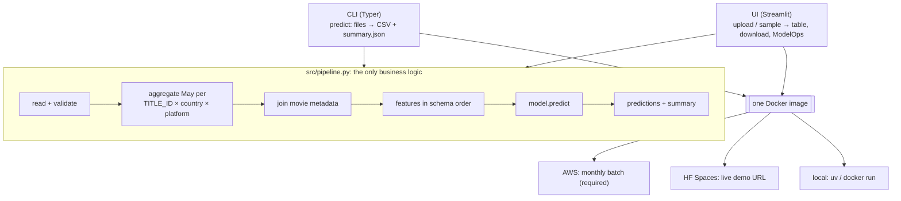
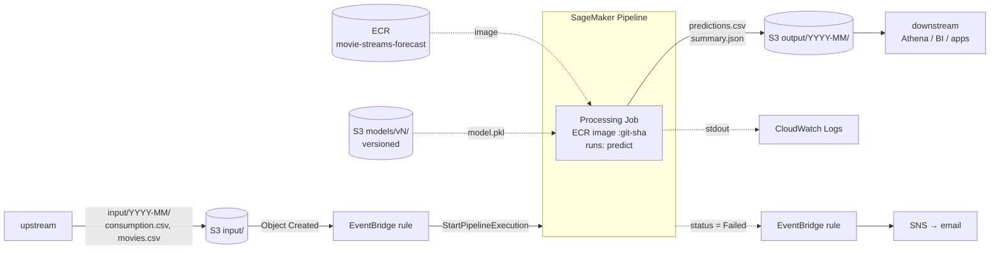

# Architecture

## Principle: one core, two entrypoints, one image

The batch job and the live app share the same code, so they can't drift apart. Any Docker host can run the image.

## Local
`uv run python -m src.cli check` (validate only) / `uv run python -m src.cli predict …` or `docker run <image> predict …`. `uv run streamlit run src/app.py` for the UI.

## AWS: monthly batch (Parts 2 + 3)

| Concern | Choice | Why |
|---|---|---|
| Compute | **SageMaker Processing Job** | Runs our script as-is on files. Batch Transform expects rows that are already prepared (ours needs a groupby and a join first). Endpoints are for real-time, which isn't needed. |
| Orchestration | **SageMaker Pipeline** (single step) | Execution history, retries and parameters, with no servers of our own. Leaves room for later steps (e.g. evaluate once June actuals arrive). |
| Trigger | **S3 → EventBridge → Pipeline** | Event-driven, so no schedule to keep in sync with the data. No Lambda needed. |
| Packaging | **Our Docker image in ECR** | The pickle needs scikit-learn 1.8.0 + Python 3.13. The prebuilt SageMaker sklearn images likely lag behind (to verify). Local and cloud run the same image. |
| Model storage | **S3 `models/<version>/`, versioned bucket** | Swapping the model doesn't need an image rebuild. The version is a pipeline parameter, so the model used for each run is recorded. |
| Output | **S3 `output/YYYY-MM/`** | Cheap, durable, and the natural hand-off point. `summary.json` records row counts, warnings and model version. |
| Permissions | 1 SageMaker execution role (read `input/`+`models/`, write `output/`, pull ECR, write logs) + 1 EventBridge role (`StartPipelineExecution`) | Least privilege, scoped to prefixes. |
| Monitoring | CloudWatch Logs + failure alarm via SNS; data checks in `summary.json` | Enough for a monthly batch. See ModelOps below. |

**Open / to verify**
- Can EventBridge pass the uploaded key's month to the pipeline as a parameter? If not: the pipeline processes the newest `input/` month, or a ~10-line Lambda starts it.
- Latest prebuilt SageMaker sklearn version (confirms we need the custom image).

## HF Spaces: live demo
- Docker Space, same image, entrypoint `streamlit` on port 7860. The model and sample data are baked into the image (7 MB).
- Deployed by pushing the repo to the Space's git remote. Free CPU tier; it sleeps when idle.

## ModelOps: what we can monitor without June actuals
- **Data quality:** row counts, nulls, negative values, duplicate keys, movie IDs without metadata.
- **Drift vs training:** unseen country/platform/genre (silently ignored by the encoder), and shifts in `may_streams` and ratings distributions against a reference computed once from the training data.
- **Prediction health:** distribution, June/May ratio, extremes.
- **Performance:** only once June actuals land. Then compute MAE/WAPE against the notebook's baseline (RF WAPE 0.62 vs May-as-June 0.85).

The same `summary.json` feeds the dashboard and would feed CloudWatch in AWS.

## Future: model updates (not in scope; the brief says use the existing model)
Our observation, not stated in the brief: the model learned one transition (May → June 2026) using one month of history.
In production the calendar drives it: at the end of month *t* you know *t*'s actuals, so the pair *t-1 → t* becomes a new training example.
- **Monthly retrain step** in the same SageMaker Pipeline, before the Processing step: a Training Job fits the notebook's estimator on all transitions so far (rolling window), split by **time**, not by movie.
- **Gate:** register the new model in the SageMaker Model Registry only if it beats the current one (and the "June = May" baseline) on the latest month. The processing step then uses the approved version.
- **Better features:** last 3 months of streams, month-of-year, movie age (instead of absolute `release_year`).
