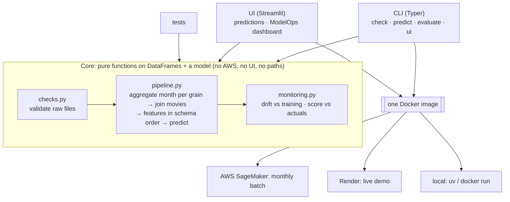
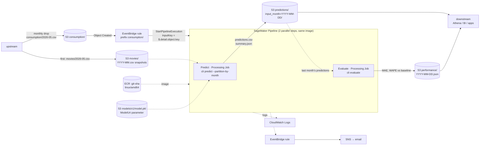

# Architecture

## Principle: hexagonal-lite (one core, thin adapters, one image)

- **The core** (`checks.py`, `pipeline.py`, `monitoring.py`) takes DataFrames and a model and returns DataFrames and dicts. It doesn't know where data comes from.
- **Driving adapters** (the CLI, the Streamlit UI and the tests) call the core, so the batch job and the live app can't drift apart.
- **The runtime contract** is "files in folders + a CLI command". SageMaker meets it by mounting S3 as folders, and AWS Batch, ECS, Cloud Run Jobs or Airflow would meet it the same way. **Changing platform changes Terraform, not Python.**
- **No formal port interfaces:** there's one storage kind (files), so an abstraction would be speculative. A second source (e.g. a database) would get its own reader module, and the core wouldn't change.

## The process, step by step: local vs Streamlit app vs AWS

All three run the same code, `run()` (checks → features → predict), and can run the same Docker image; only the way data comes in and goes out differs.

| Step | Local (CLI) | Streamlit app (Render) | AWS (SageMaker) |
|---|---|---|---|
| **1. Data arrives** | CSV files on disk: `data/*.csv` by default, or any path via `--movies` / `--consumption` | The user uploads the movies and consumption CSVs in the sidebar (or picks the sample files) | Upstream uploads `movies/YYYY-MM.csv`, then `consumption/YYYY-MM.csv` to the S3 bucket |
| **2. Run starts** | You run `uv run python -m src.cli predict` (or `docker run <image> predict`) | Streamlit reruns the script as soon as both files are there | S3 "Object Created" → EventBridge rule (prefix `consumption/`) → `StartPipelineExecution` with `InputKey` = the file key |
| **3. Files reach the code** | Read straight from the given paths (a file, or a folder holding one file) | Uploaded files are read in memory (`read_csv`) | SageMaker downloads each S3 input into a folder under `/opt/ml/processing/input/`; the CLI picks the file (and that month's movie snapshot) |
| **4. Model loaded** | `artifacts/movie_consumption_model.pkl`, or `--model <path>` | `artifacts/movie_consumption_model.pkl` baked into the image, loaded once (`st.cache_resource`) | `models/v1/model.pkl` from S3 (`ModelUri` parameter), so a new model needs no rebuild |
| **5. Month** | Inferred from the file, or `--month YYYY-MM-DD` | Inferred from the file, or typed in the sidebar | Inferred from the file (EventBridge can't parse it from the key) |
| **6. Data checks** | 15 checks (also alone with `cli check`); errors exit 1, the log has the check, CSV lines and fix prompt | 15 checks; errors show a table + a copyable fix prompt and stop | Same 15 checks; errors fail the step, the log has the check, CSV lines and fix prompt |
| **7. Features + predict** | `run()` via `cli predict` | `run()`: sum per movie × country × platform, join movies, predict with the model's own preprocessing | Same `run()`, via `cli predict --partition-by-month` (Predict step) |
| **8. Results out** | `output/predictions.csv` + `summary.json` | Tables and charts on screen + CSV download | `s3://…/predictions/input_month=YYYY-MM-DD/predictions.csv + summary.json` |
| **9. Accuracy** | `cli evaluate --actuals <next month's file>` → `artifacts/performance/<month>.json` | Monitoring tab reads the accuracy history (`artifacts/performance/`) | Evaluate step, in parallel: this month's file scores last month's predictions → `performance/<month>.json` |
| **10. Monitoring** | Terminal log + `summary.json` (or `cli ui` for the dashboard) | Tabs: drift vs training, data quality, accuracy by month | CloudWatch Logs; pipeline `Failed` → EventBridge → SNS email |
| **11. Who consumes it** | You, or any script reading `output/` | The person using the app | Downstream: Athena / BI / apps reading `predictions/` and `performance/` |
| **Defined in** | `pyproject.toml` + `uv.lock` (or the `Dockerfile`) | `Dockerfile` + Render service (auto-deploy on push) | `infra/*.tf` (S3, ECR, IAM, Pipeline, EventBridge, SNS) |

## Local
`uv run python -m src.cli check` (validate only) / `uv run python -m src.cli predict …` or `docker run <image> predict …`. `uv run python -m src.cli ui` for the UI (the image's default command).

## AWS: monthly batch (Parts 2 + 3)

**One run, step by step**
1. Upstream first uploads that month's movie metadata snapshot to `s3://<bucket>/movies/2026-05.csv`, then the consumption file to `s3://<bucket>/consumption/2026-05.csv`. New titles arrive and ratings/votes change every month, so each month gets its own snapshot (as of the end of the month). Predict picks the snapshot of the month it reads from the consumption file and fails if it is missing, instead of using stale metadata. Reruns of an old month use that month's metadata (no look-ahead).
2. The bucket sends "Object Created" to EventBridge. A rule matching the `consumption/` prefix starts the pipeline and passes the object key as the `InputKey` parameter (a JSON path, `$.detail.object.key`, resolved from the event).
3. The pipeline runs two Processing Jobs in parallel, same image, different command. SageMaker downloads each input into a folder under `/opt/ml/processing/input/`.
   - **Predict** runs `predict --consumption … --movies … --model … --output-dir /opt/ml/processing/predictions --partition-by-month`. The month is **read from the file** (a monthly drop contains one month), and the data checks run first. Output: `predictions/input_month=2026-05-01/predictions.csv + summary.json`. A rerun overwrites its own month (idempotent).
   - **Evaluate** runs `evaluate --actuals …/consumption --predictions …/predictions --history-dir /opt/ml/processing/performance`. This month's file is the **actuals for last month's predictions**: it finds the predictions whose `target_month` is this month and scores them (MAE, RMSE, WAPE, R², each vs the "next month = this month" baseline) into `performance/2026-06-01.json`. The first month has nothing to score and exits cleanly.
4. On failure of either step (e.g. a data check), the pipeline status goes `Failed` → EventBridge → SNS email. The log names the failed check and the CSV lines.

| Concern | Choice | Why |
|---|---|---|
| Compute | **SageMaker Processing Job** (`ml.t3.medium`) | Runs our script as-is on files. Batch Transform expects rows that are already prepared (ours needs a groupby and a join first). Endpoints are for real-time, which isn't needed. The data is tiny, so the smallest instance is enough. |
| Orchestration | **SageMaker Pipeline** (Predict + Evaluate, in parallel) | Execution history, parameters, retries, and a native EventBridge target, with no servers of our own. Leaves room for the retraining step (see Future). |
| Trigger | **S3 → EventBridge → Pipeline** | Event-driven, so no schedule to keep in sync with the data. EventBridge passes the file key straight into the pipeline, so **no Lambda**. |
| Packaging | **Our Docker image in ECR**, `linux/amd64`, tagged by git SHA | Prebuilt SageMaker sklearn images stop at **1.4-2**; the pickle needs **1.8.0** + Python 3.13. Same image as local (verified: identical predictions on arm64 and amd64). |
| Month | **Inferred from the file**, `--month` optional | EventBridge can pass the key but can't parse a month out of it. A monthly file holds one month; ambiguous files fail loudly. |
| Model storage | **S3 `models/v1/model.pkl`, versioned bucket** | `ModelUri` is a pipeline parameter (default v1), so every execution records which model it used. New model = upload + change the default, no image rebuild. |
| Output | **S3 `predictions/input_month=YYYY-MM-DD/`** | One folder per month: predictable for downstream and for Evaluate, reruns are idempotent, and it's Athena/Hive-partition friendly. The pipeline execution (inputs, model, logs) is still visible in SageMaker. |
| Accuracy tracking | **Evaluate step** in the same run, one JSON per month in `performance/` | No extra trigger: the file that starts month *t+1*'s prediction is the ground truth for month *t*. One small file per month (no read-modify-write of a shared history). The dashboard reads the same files. |
| Permissions | **SageMaker execution role**: read `consumption/`, `movies/`, `models/`, `predictions/`; write `predictions/`, `performance/`; pull from ECR; write CloudWatch Logs. **EventBridge role**: `sagemaker:StartPipelineExecution` on this pipeline only. | Least privilege, scoped to prefixes and one pipeline. |
| Monitoring | CloudWatch Logs (`/aws/sagemaker/ProcessingJobs`), EventBridge rule on pipeline status `Failed` → SNS email, `summary.json` per run | Enough for one run a month. See ModelOps below. |

**Resolved (2026-09-27, AWS docs)**
- EventBridge → SageMaker Pipeline supports **dynamic parameters** via JSON path from the event ([docs](https://docs.aws.amazon.com/sagemaker/latest/dg/pipeline-eventbridge.html)).
- Prebuilt SageMaker scikit-learn containers support up to **1.4-2** ([docs](https://docs.aws.amazon.com/sagemaker/latest/dg/sklearn.html)), so the custom image is required.

**Unverified without an AWS account**: the exact pipeline-definition JSON, IAM policy completeness, and the S3 → EventBridge → pipeline wiring end to end. How to validate: `terraform validate`/`plan`, then one manual upload in a sandbox account.

## Live demo: Render

| Concern | Choice | Why |
|---|---|---|
| UI | **Streamlit** (`src/app.py`) | Upload, tables, charts and download in plain Python. It calls the same `run()` as the CLI, so the app and the batch job can't drift apart. |
| Hosting | **Render free web service**, built from our `Dockerfile` | Same image as local and SageMaker. Hugging Face Docker Spaces needed PRO. |
| Deploy | Auto-deploy on every push to `main` | No pipeline to maintain for a demo. |
| Input | Sample files or **CSV upload** | Anyone can try their own month without the CLI. |
| Validation | Same checks as the CLI; failures show an error table + a **fix prompt** for an AI agent | One set of rules everywhere. |
| ModelOps | Tabs: Overview, Forecast, Monitoring (drift, accuracy by month), Data quality | Drift compares against saved stats (`drift_reference.json`), so the app never reads training data. |
| Model | Loaded once per process (`st.cache_resource`) | The pickle is loaded once, not on every interaction. |
| Cost / limits | Free tier, sleeps when idle (~30–60 s cold start) | Enough for a demo; no cloud bill. |

- A free Render web service built from the repo's `Dockerfile`: the same image as local and SageMaker, default command `ui`, listening on `$PORT` (set by Render).
- Redeploys automatically on every push to `main`. The free tier sleeps when idle, so the first request takes ~30–60 s.
- Hugging Face Spaces was the first choice, but Docker Spaces now need a PRO subscription (found at deploy time).

## ModelOps
- **Data quality:** row counts, nulls, negative values, duplicate keys, movie IDs without metadata, id format, and case/spacing variants of known categories (`netflix` → `Netflix`).
- **Drift vs training:** unseen country/platform/genre (silently ignored by the encoder), and shifts in `may_streams` and ratings distributions against a reference computed once from the training data.
- **Prediction health:** distribution, June/May ratio, extremes.
- **Accuracy by month:** the Evaluate step scores each month once its actuals land. The history is seeded with the one real measurement we have: the notebook's holdout for v1 (WAPE 0.62 vs 0.85 baseline, 310 rows of unseen films). Real monthly rows are added from there on, and nothing is back-filled or invented.

The same `summary.json` feeds the dashboard and would feed CloudWatch in AWS.

## Future: model updates (not in scope; the brief says use the existing model)
Our observation, not stated in the brief: the model learned one transition (May → June 2026) using one month of history.
In production the calendar drives it: at the end of month *t* you know *t*'s actuals, so the pair *t-1 → t* becomes a new training example.
- **Monthly retrain step** in the same SageMaker Pipeline, after Evaluate: a Training Job fits the notebook's estimator on all transitions so far (rolling window), split by **time**, not by movie.
- **Gate:** register the new model in the SageMaker Model Registry only if it beats the current one (and the "June = May" baseline) on the latest month. The processing step then uses the approved version.
- **Better features:** last 3 months of streams, month-of-year, movie age (instead of absolute `release_year`).
