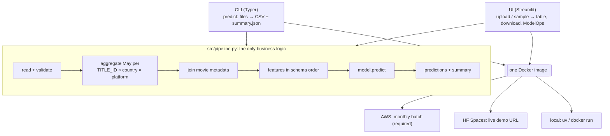
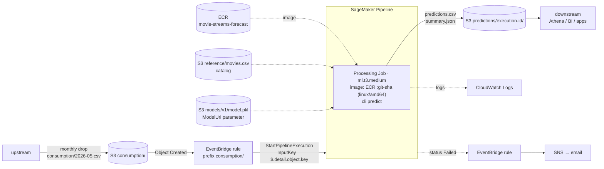

# Architecture

## Principle: one core, two entrypoints, one image

The batch job and the live app share the same code, so they can't drift apart. Any Docker host can run the image.

## Local
`uv run python -m src.cli check` (validate only) / `uv run python -m src.cli predict …` or `docker run <image> predict …`. `uv run streamlit run src/app.py` for the UI.

## AWS: monthly batch (Parts 2 + 3)

**One run, step by step**
1. Upstream uploads the month's file to `s3://<bucket>/consumption/2026-05.csv`. Only consumption changes monthly; the movie catalog lives at `reference/movies.csv` and is updated whenever upstream refreshes it.
2. The bucket sends "Object Created" to EventBridge. A rule matching the `consumption/` prefix starts the pipeline and passes the object key as the `InputKey` parameter (a JSON path, `$.detail.object.key`, resolved from the event).
3. The pipeline's only step is a Processing Job running our image. SageMaker downloads each input into a folder:
   `/opt/ml/processing/input/{consumption,movies,model}`. The container runs the same command every month:
   `predict --consumption …/consumption --movies …/movies --model …/model --output-dir /opt/ml/processing/output`.
   The month is **read from the file** (a monthly drop contains one month), and the data checks run first.
4. On success SageMaker uploads `predictions.csv` + `summary.json` to `predictions/<pipeline-execution-id>/`. On failure (e.g. a data check), the pipeline status goes `Failed` → EventBridge → SNS email. The log names the failed check and the CSV lines.

| Concern | Choice | Why |
|---|---|---|
| Compute | **SageMaker Processing Job** (`ml.t3.medium`) | Runs our script as-is on files. Batch Transform expects rows that are already prepared (ours needs a groupby and a join first). Endpoints are for real-time, which isn't needed. The data is tiny, so the smallest instance is enough. |
| Orchestration | **SageMaker Pipeline** (single step) | Execution history, parameters, retries, and a native EventBridge target, with no servers of our own. Leaves room for the retraining step (see Future). |
| Trigger | **S3 → EventBridge → Pipeline** | Event-driven, so no schedule to keep in sync with the data. EventBridge passes the file key straight into the pipeline, so **no Lambda**. |
| Packaging | **Our Docker image in ECR**, `linux/amd64`, tagged by git SHA | Prebuilt SageMaker sklearn images stop at **1.4-2**; the pickle needs **1.8.0** + Python 3.13. Same image as local (verified: identical predictions on arm64 and amd64). |
| Month | **Inferred from the file**, `--month` optional | EventBridge can pass the key but can't parse a month out of it. A monthly file holds one month; ambiguous files fail loudly. |
| Model storage | **S3 `models/v1/model.pkl`, versioned bucket** | `ModelUri` is a pipeline parameter (default v1), so every execution records which model it used. New model = upload + change the default, no image rebuild. |
| Output | **S3 `predictions/<execution-id>/`** | One folder per run: reruns never overwrite, and each output traces back to its execution (inputs, model, logs). `input_month`/`target_month` columns make it queryable by month (Athena table over `predictions/`). |
| Permissions | **SageMaker execution role**: read `consumption/`, `reference/`, `models/`; write `predictions/`; pull from ECR; write CloudWatch Logs. **EventBridge role**: `sagemaker:StartPipelineExecution` on this pipeline only. | Least privilege, scoped to prefixes and one pipeline. |
| Monitoring | CloudWatch Logs (`/aws/sagemaker/ProcessingJobs`), EventBridge rule on pipeline status `Failed` → SNS email, `summary.json` per run | Enough for one run a month. See ModelOps below. |

**Resolved (2026-09-27, AWS docs)**
- EventBridge → SageMaker Pipeline supports **dynamic parameters** via JSON path from the event ([docs](https://docs.aws.amazon.com/sagemaker/latest/dg/pipeline-eventbridge.html)).
- Prebuilt SageMaker scikit-learn containers support up to **1.4-2** ([docs](https://docs.aws.amazon.com/sagemaker/latest/dg/sklearn.html)), so the custom image is required.

**Unverified without an AWS account**: the exact pipeline-definition JSON, IAM policy completeness, and the S3 → EventBridge → pipeline wiring end to end. How to validate: `terraform validate`/`plan`, then one manual upload in a sandbox account.

## HF Spaces: live demo
- Docker Space, same image, entrypoint `streamlit` on port 7860. The model and sample data are baked into the image (7 MB).
- Deployed by pushing the repo to the Space's git remote. Free CPU tier; it sleeps when idle.

## ModelOps: what we can monitor without June actuals
- **Data quality:** row counts, nulls, negative values, duplicate keys, movie IDs without metadata.
- **Drift vs training:** unseen country/platform/genre (silently ignored by the encoder), and shifts in `may_streams` and ratings distributions against a reference computed once from the training data.
- **Prediction health:** distribution, June/May ratio, extremes.
- **Performance:** only once June actuals land. Then compute MAE/WAPE against the notebook's baseline (RF WAPE 0.62 vs May-as-June 0.85).

The same `summary.json` feeds the dashboard and would feed CloudWatch in AWS.

## Future: model updates (not in scope; the brief says use the existing model)
Our observation, not stated in the brief: the model learned one transition (May → June 2026) using one month of history.
In production the calendar drives it: at the end of month *t* you know *t*'s actuals, so the pair *t-1 → t* becomes a new training example.
- **Monthly retrain step** in the same SageMaker Pipeline, before the Processing step: a Training Job fits the notebook's estimator on all transitions so far (rolling window), split by **time**, not by movie.
- **Gate:** register the new model in the SageMaker Model Registry only if it beats the current one (and the "June = May" baseline) on the latest month. The processing step then uses the approved version.
- **Better features:** last 3 months of streams, month-of-year, movie age (instead of absolute `release_year`).
